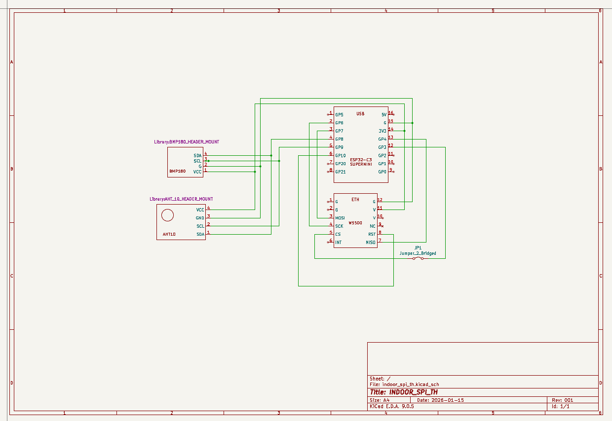

    # SPI_TH: ESP32 Temperature & Humidity Sensor with Ethernet UDP Streaming

**Author:** Mert Kaan

## Overview

SPI_TH is an IoT project built on the ESP32C3 microcontroller that reads temperature and humidity data from an AHT10 sensor via I2C and streams the data over Ethernet using UDP protocol. The system is designed for real-time environmental monitoring with low-latency data transmission to a remote PC or server.

### Key Features
- **AHT10 Temperature & Humidity Sensor** - High-precision sensor readings
- **Ethernet Connectivity** - Direct Ethernet interface for reliable network communication
- **UDP Data Streaming** - Real-time sensor data transmission in JSON format
- **I2C Protocol** - Efficient sensor communication
- **FreeRTOS Based** - Multi-tasking support for concurrent operations
- **Modular Architecture** - Well-organized component-based structure

---

## Hardware Components

### Microcontroller
- **ESP32C3** - 32-bit RISC-V processor with integrated Ethernet MAC

### Sensors
- **AHT10** - Temperature and Humidity sensor (I2C interface, address: 0x38)
  - Temperature Range: -40°C to 85°C
  - Humidity Range: 0% to 100% RH
  - I2C Frequency: 100 kHz to 400 kHz

### Connectivity
- **Ethernet Interface** - Direct RJ45 connection for network communication

### Supporting Components
- I2C pull-up resistors (typically 4.7kΩ)
- Ethernet transformer and magnetics
- Bypass capacitors for power supply decoupling

---

## Project Structure

```
Spi_TH/
├── main/
│   ├── CMakeLists.txt
│   └── main.c              # Main application entry point
├── components/
│   ├── aht10/              # AHT10 sensor driver
│   │   ├── inc/
│   │   ├── src/
│   │   └── CMakeLists.txt
│   ├── i2c_handler/        # I2C bus initialization and management
│   │   ├── inc/
│   │   ├── src/
│   │   └── CMakeLists.txt
│   ├── ethernet_init/      # Ethernet driver initialization
│   │   ├── inc/
│   │   ├── src/
│   │   └── CMakeLists.txt
│   ├── udp_sender/         # UDP client for data transmission
│   │   ├── inc/
│   │   ├── src/
│   │   └── CMakeLists.txt
│   ├── sensor_tasks/       # FreeRTOS tasks for sensor reading
│   ├── bmp180/             # BMP180 pressure sensor (optional)
│   └── espnow_sender/      # ESP-NOW protocol support (optional)
├── CMakeLists.txt
├── README.md
└── sdkconfig               # ESP-IDF configuration file
```

---

## Software Architecture

### Main Components

#### 1. **I2C Handler** (`components/i2c_handler/`)
Manages the I2C master bus initialization and device communication.
- Initializes ESP32 I2C peripheral
- Configures bus frequency and GPIO pins
- Provides device addition and management functions

#### 2. **AHT10 Driver** (`components/aht10/`)
Implements AHT10 sensor communication protocol.
- Soft reset and calibration commands
- Trigger measurement and data reading
- Returns temperature and humidity in `aht10_data_t` structure

#### 3. **Ethernet Initialization** (`components/ethernet_init/`)
Sets up Ethernet driver and network interface.
- Initializes Ethernet MAC and PHY
- Configures network stack integration
- Handles multiple Ethernet ports (if available)

#### 4. **UDP Sender** (`components/udp_sender/`)
Transmits sensor data to remote host via UDP.
- Waits for network interface to be operational
- Creates UDP socket and sends JSON-formatted data
- Implements retry mechanism on transmission failure
- Data format: `{"temperature": XX.XX, "humidity": YY.YY, "timelaps_ms": ZZZZ}`

### Initialization Sequence

```
1. Ethernet driver initialization
2. TCP/IP stack setup
3. Event loop creation
4. Ethernet interface configuration
5. Event handler registration
6. Ethernet driver start
7. I2C bus initialization
8. AHT10 sensor initialization
9. UDP sender task creation
```

### Data Flow

```
AHT10 Sensor
    ↓ (I2C)
I2C Handler
    ↓
AHT10 Driver (reads temperature/humidity)
    ↓
UDP Sender Task (formats JSON)
    ↓
Ethernet Interface
    ↓
UDP Server (Remote PC/Host)
```

---

## Configuration

### Network Settings

Edit `components/udp_sender/src/udp_sender.c`:

```c
#define UDP_SERVER_IP "192.168.1.10"    // Your PC's IP address
#define UDP_SERVER_PORT 5005             // Listening port
#define SEND_INTERVAL_MS 5000            // Data send interval (ms)
```

### I2C Configuration

Edit `components/i2c_handler/src/i2c_handler.c` to set:
- GPIO pins for SDA and SCL
- I2C bus frequency
- Bus timeout values

### AHT10 Configuration

Edit `components/aht10/src/aht10.c` to set:
- I2C device address (0x38 or 0x39)
- Sensor calibration parameters

---

## Building and Flashing

### Prerequisites
- ESP-IDF v5.5 or later
- ESP32C3 development board
- USB-to-UART bridge for flashing

### Build Steps

```bash
# Set ESP-IDF environment
set IDF_PATH=C:/Espressif/frameworks/esp-idf-v5.5/

# Build the project
idf.py build

# Flash to ESP32C3
idf.py flash

# Monitor serial output
idf.py monitor
```

### ESP-IDF Commands

```bash
# Clean build
idf.py fullclean

# Menuconfig for advanced settings
idf.py menuconfig

# Partition table analysis
idf.py partition_table

# Project size analysis
idf.py size
```

---

## Usage

### Setting Up a UDP Receiver on PC

#### Option 1: Python Script
```python
import socket
import json

sock = socket.socket(socket.AF_INET, socket.SOCK_DGRAM)
sock.bind(('0.0.0.0', 5005))
print("Listening on port 5005...")

while True:
    data, addr = sock.recvfrom(1024)
    try:
        sensor_data = json.loads(data.decode())
        print(f"From {addr}: Temp={sensor_data['temperature']}°C, Humidity={sensor_data['humidity']}%")
    except json.JSONDecodeError:
        print(f"Invalid JSON from {addr}")
```

#### Option 2: Netcat (Linux/Windows)
```bash
nc -u -l 5005
```

#### Option 3: Node.js
```javascript
const dgram = require('dgram');
const server = dgram.createSocket('udp4');

server.on('message', (msg, info) => {
    console.log(`Received: ${msg.toString()}`);
    const data = JSON.parse(msg.toString());
    console.log(`Temp: ${data.temperature}°C, Humidity: ${data.humidity}%`);
});

server.bind(5005, '0.0.0.0');
console.log('Listening on port 5005...');
```

### Expected Output

Serial Monitor:
```
I (2304) APP_MAIN: Ethernet HW Addr 0a:92:72:84:f8:24
I (2404) APP_MAIN: Ethernet Got IP Address
I (2404) APP_MAIN: ETHIP:192.168.1.100
I (2504) AHT10: Temperature: 22.10 °C, Humidity: 60.36 %
I (2504) udp_sender: Sent 65 bytes: {"temperature":22.1,"humidity":60.36,"timelaps_ms":2400}
```

---

## Troubleshooting

### UDP Connection Issues

**Error: "errno 118 (EHOSTUNREACH)"**
- Verify PC IP address is correct in `UDP_SERVER_IP`
- Ensure UDP receiver is running on the PC
- Check Windows Firewall allows UDP port 5005
- Verify both devices are on the same network

**Error: "Unable to create socket"**
- Check if Ethernet interface is properly initialized
- Verify ESP32 has obtained an IP address
- Check available memory and stack size

### Sensor Issues

**Error: "AHT10 init failed"**
- Verify AHT10 I2C connections (SDA, SCL, GND, VCC)
- Check I2C pull-up resistors are present (4.7kΩ)
- Verify I2C address is correct (0x38 by default)
- Ensure I2C frequency is within sensor specifications

**Error: "AHT10 read failed"**
- Check sensor is properly powered
- Verify I2C communication with sensor
- Increase delay after initialization

### Ethernet Issues

**Error: "Ethernet Link Down"**
- Check physical Ethernet connection
- Verify network cable is not damaged
- Check Ethernet PHY power supply
- Verify Ethernet transformer connections

---

## Performance Metrics

- **Sensor Read Interval:** 5000 ms (configurable)
- **I2C Frequency:** 400 kHz
- **UDP Payload Size:** ~60 bytes (JSON format)
- **Network Latency:** <1 ms (local network)
- **Total System Current:** ~100-150 mA (at 3.3V)

---

## Project Images

> **Note:** Reserved space for project images. Please add the following:

### Hardware Enclosure

*Add image of the complete assembled unit in its enclosure*

### PCB Design

*Add image of PCB top side showing component placement*


*Add image of PCB bottom side showing traces and connections*

### Circuit Schematic

*Add detailed circuit schematic showing all connections*

### Block Diagram

*Add system architecture block diagram*

---

## Testing Checklist

- [ ] ESP32C3 board powers on correctly
- [ ] Serial monitor shows initialization sequence
- [ ] Ethernet link is established
- [ ] ESP32 obtains IP address via DHCP
- [ ] AHT10 sensor is initialized successfully
- [ ] Temperature and humidity readings are reasonable
- [ ] UDP packets are transmitted to PC
- [ ] PC receives and parses JSON data correctly
- [ ] Data updates at the configured interval

---

## Future Enhancements

- [ ] Web dashboard for real-time data visualization
- [ ] Data logging to SD card
- [ ] MQTT protocol support
- [ ] Multiple sensor support
- [ ] Deep sleep mode for power efficiency
- [ ] OTA (Over-The-Air) firmware updates
- [ ] SSL/TLS encryption for UDP
- [ ] BMP180 pressure sensor integration
- [ ] Data buffering during network outages

---

## Dependencies

- **ESP-IDF:** v5.5
- **FreeRTOS:** Integrated with ESP-IDF
- **cJSON:** JSON library (included in project)
- **Standard C Libraries:** stdio.h, string.h, sys/socket.h, etc.

---

## License

This project is open for personal and educational use.

---

## Support & Contact

For questions, issues, or contributions, please refer to the project documentation or contact the author.

**Author:** Mert Kaan Çukadar
**Project Name:** SPI_TH (SPI Temperature & Humidity Monitoring System)  
**Last Updated:** February 2026
    
    